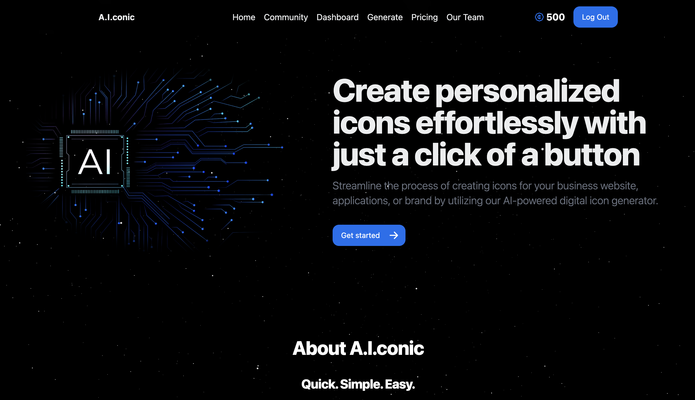

# Project 3 &middot; [](https://github.com/WebDevMullins/svg-logo-maker/blob/main/LICENSE)

<p align="center">


</p>

Our startup leverages the DALL-E engine in an AI-driven platform to revolutionize logo design for busy entrepreneurs. Built on React, Express, and MongoDB, our user-friendly interface allows instant generation of unique logos tailored to your brand.

## Table of Contents

- [Installation](#installation)
- [Usage](#usage)
- [Demo](#demo)
- [License](#license)

## Installation

### Clone repo to destinaton.

```bash
git clone git@github.com:WebDevMullins/project-3.git
```

### Install dependencies using:

```bash
npm install
```

## Usage

From the root directory, run the following to start the application:

```bash
npm run develop
```

## Demo

### Deployed Site on Render: https://project-3-8j08.onrender.com/



## License

Project 3 is [MIT licensed](./LICENSE).
